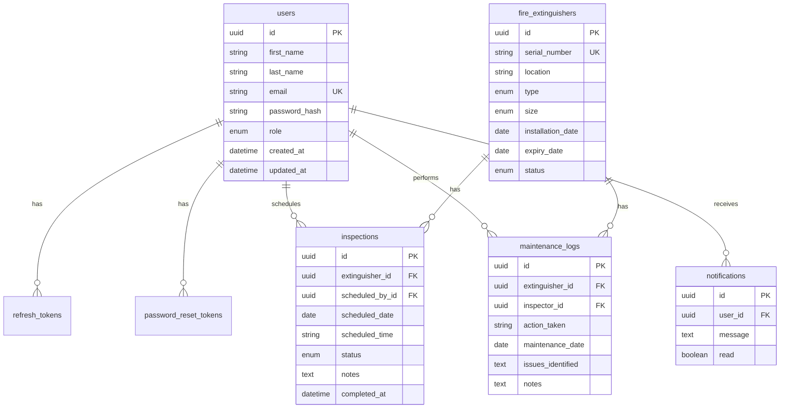

# Entity Relationship Diagram — FEMS

## Mermaid ERD

## Table Relationships

| Parent | Child | Relationship |
|--------|-------|--------------|
| users | refresh_tokens | 1:N cascade delete |
| users | password_reset_tokens | 1:N cascade delete |
| users | inspections | 1:N (scheduled_by) |
| users | maintenance_logs | 1:N (inspector) |
| users | notifications | 1:N cascade delete |
| fire_extinguishers | inspections | 1:N cascade delete |
| fire_extinguishers | maintenance_logs | 1:N cascade delete |

## Indexes

- `users.email` — UNIQUE
- `fire_extinguishers.serial_number` — UNIQUE
- `fire_extinguishers.expiry_date`, `installation_date`, `status`
- `inspections.scheduled_date`, `status`, `extinguisher_id`
- `maintenance_logs.maintenance_date`, `extinguisher_id`

## Logical Microservices Mapping

| Service | Tables |
|---------|--------|
| User Management | users |
| Authentication | users, refresh_tokens, password_reset_tokens |
| Fire Extinguisher | fire_extinguishers |
| Inspection & Maintenance | inspections, maintenance_logs |
| Notification | notifications |
| Reporting | Aggregates across all tables |
