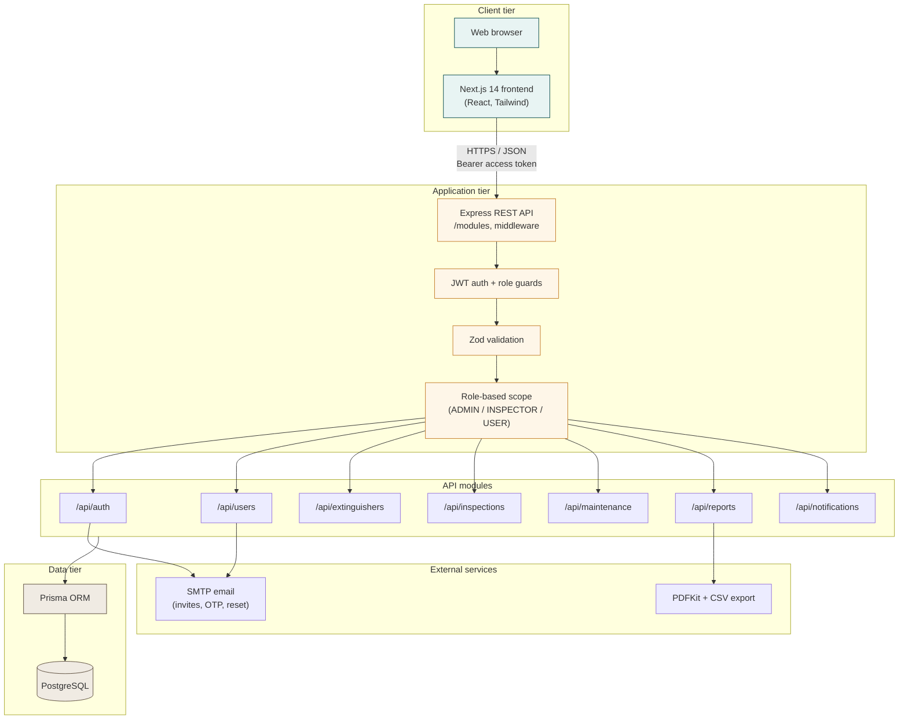
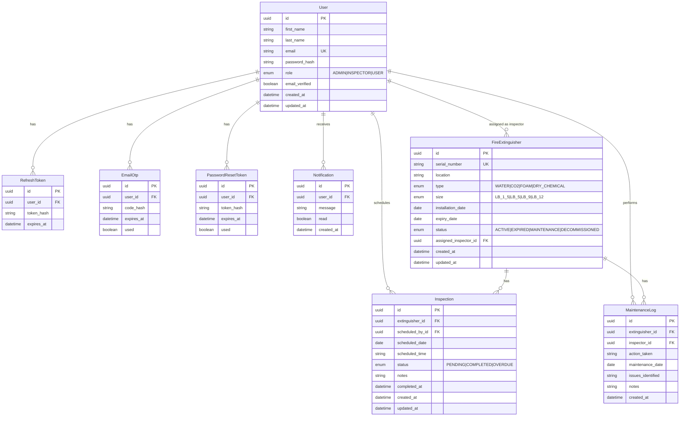
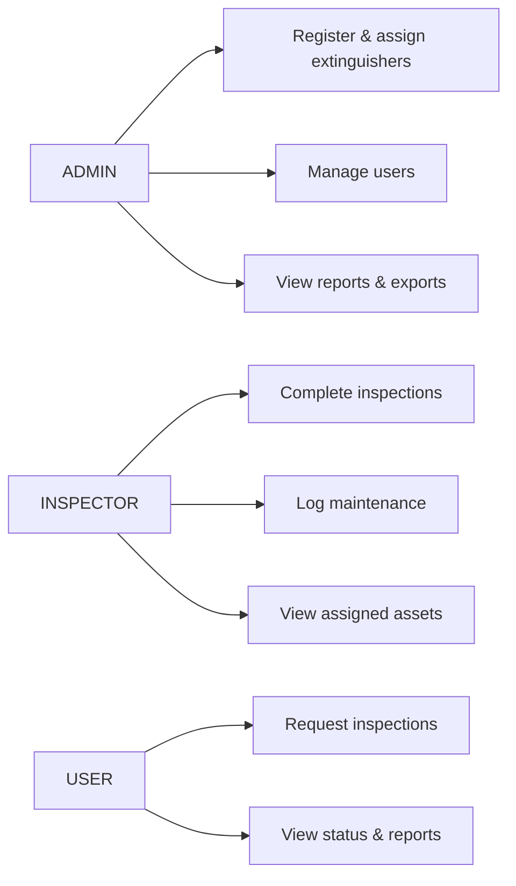

# FEMS — System diagrams (Mermaid)

Copy either block into [Mermaid Live Editor](https://mermaid.live), GitHub markdown, or documentation tools.

## System architecture

## Database ER diagram

## Role-based access (reference)

